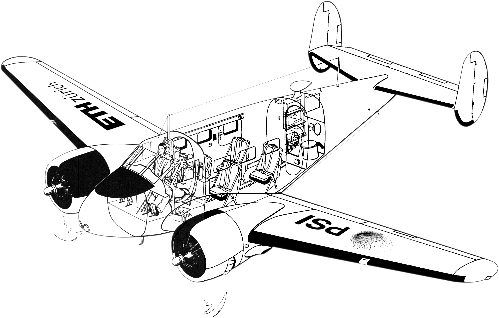

# AircraftDetective

`aircraftdetective` is a Python package for estimating key performance characteristics of commercial aircraft from a set of publicly available data sources. It is designed to be used in the context of environmental impact assessment of air travel, aircraft performance analysis and optimisation.

Cutaway derived from the _Flight Handbook USAF Series C45H Aircraft, AN 1-90CDC-1, 1953_  
[Adapted from a public domain image via Wikimedia Commons.](https://commons.wikimedia.org/wiki/File:C-45_General_Arrangement_Diagram_%E2%80%93_Without_Labels.png)